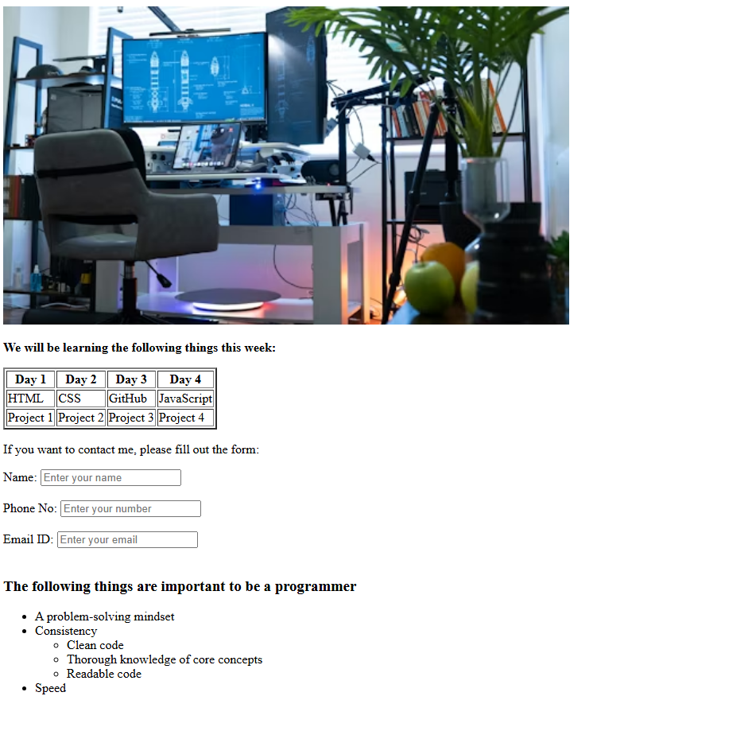

# 📅 Weekly Learning Schedule Webpage

## 📌 Project Overview

This project is a simple HTML webpage that displays:

* A banner image
* A weekly learning schedule in table format
* A contact form
* A list of important qualities to become a programmer

It is built using basic **HTML5** elements and is ideal for beginners practicing core HTML concepts.

---



## 🛠 Technologies Used

* HTML5

---

## 📚 Features

### 1️⃣ Banner Image

Displays a workspace-themed image at the top of the page.

### 2️⃣ Weekly Learning Table

Shows a 4-day learning plan:

| Day 1     | Day 2     | Day 3     | Day 4      |
| --------- | --------- | --------- | ---------- |
| HTML      | CSS       | GitHub    | JavaScript |
| Project 1 | Project 2 | Project 3 | Project 4  |

### 3️⃣ Contact Form

Includes:

* Name (required)
* Phone Number
* Email (required)

Uses built-in HTML validation.

### 4️⃣ Programmer Qualities List

Highlights important traits:

* Problem-solving mindset
* Consistency

  * Clean code
  * Core concept knowledge
  * Readable code
* Speed

---

## 📂 File Structure

```
project-folder/
│
├── index.html
└── README.md
```

---

## 🚀 How to Run

1. Download or clone the repository.
2. Open `index.html` in your web browser.
3. No installation required.

---

## 🎯 Learning Objectives

This project helps practice:

* HTML document structure
* Headings and paragraphs
* Tables
* Forms and input types
* Lists (ordered & nested)
* Image embedding
* Basic page layout

---

## 💡 Future Improvements

* Add CSS styling
* Make the form functional with backend integration
* Improve responsiveness
* Add navigation bar
* Add form submission button

---

## 👨‍💻 Author

AMRITHA MOHANAN


